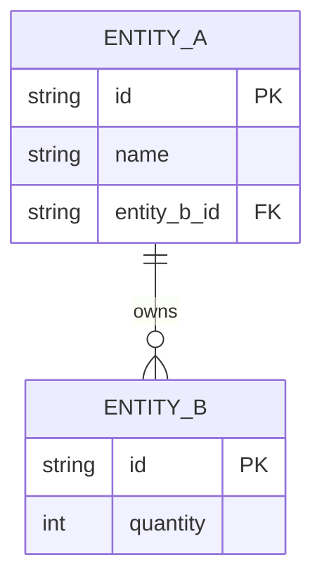
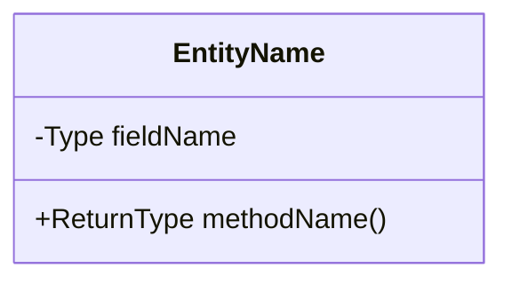
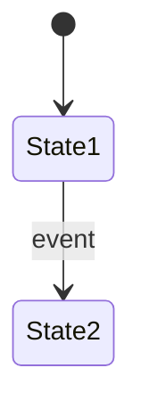

# LLD Design Prompt Template

> **FORMAT RULE: Always generate output as `.html` files, never `.md`. Use styled HTML with inline CSS for readability.**

Use this prompt whenever you need to design a Low Level Design (LLD) problem end-to-end.

---

## Prompt

```
Design the Low Level Design (LLD) for: **[SYSTEM NAME]**

Follow this exact structure:

---

### 1. CLARIFY REQUIREMENTS (Functional + Non-Functional)
List 5–8 functional requirements and 3–4 non-functional requirements.
Explicitly state what is OUT OF SCOPE.

---

### 2. IDENTIFY CORE ENTITIES
List every real-world noun in the system that needs its own class.
For each entity state:
- Name
- Responsibility (one sentence)
- Key attributes (3–5 fields with Java types)

Schema format:
| Entity | Responsibility | Key Fields |
|--------|---------------|------------|
| ...    | ...           | ...        |

---

### 2b. SCHEMA / ER DIAGRAM (Mermaid)
Generate a Mermaid `erDiagram` showing:
- All entities with their attributes and types
- Primary keys marked with `PK`, foreign keys with `FK`
- Relationships with cardinality (`||--o{`, `}o--o{`, `||--||`) and a verb label
- Use this to visualize the data schema BEFORE jumping into class relationships



---

### 3. CLASS DIAGRAM (Mermaid)
Generate a Mermaid classDiagram showing:
- All entities as classes with fields and methods
- Relationships: inheritance (--|>), composition (--*), aggregation (--o), association (-->)
- Interfaces and abstract classes clearly marked



---

### 4. DESIGN PATTERNS USED
For each pattern applied state:
- Pattern name
- Which classes participate
- Why this pattern fits here (one sentence)

---

### 5. SEQUENCE DIAGRAM for PRIMARY FLOW (Mermaid)
Show the happy-path sequence for the single most important operation.

```mermaid
sequenceDiagram
    actor User
    participant Service
    participant Repository
    ...
```

---

### 6. STATE DIAGRAM for KEY ENTITY (Mermaid)
Show all states and valid transitions for the entity with the most lifecycle complexity.



---

### 7. JAVA IMPLEMENTATION
Provide complete, compilable Java code in this order:
1. Enums
2. Interfaces / Abstract classes
3. Core entity classes (POJO + logic)
4. Service layer (business logic)
5. A main() demo that exercises the primary flow end-to-end

Rules:
- Use Java 17+ features where relevant (records, sealed classes, switch expressions)
- No frameworks (no Spring, no Hibernate) — pure Java
- Thread-safety: mark any shared state and explain synchronization choice
- Use Builder pattern for objects with >3 constructor params
- All collections via interfaces (List, Map, Set — not ArrayList directly)

---

### 8. INTUITION BUILDING — STEP BY STEP
Explain HOW to arrive at this design from scratch, as if teaching someone for the first time:

Step 1 — Start from the problem statement, not the solution
  → What is the single most important action a user performs?

Step 2 — Find the nouns (entities) and verbs (behaviors)
  → Nouns become classes, verbs become methods

Step 3 — Ask: who OWNS what?
  → Ownership drives composition vs aggregation

Step 4 — Identify what CHANGES STATE over time
  → These become your stateful entities; apply State pattern if transitions are complex

Step 5 — Spot repeated behavior → extract to interface/abstract class

Step 6 — Find the variation points (things likely to change)
  → Apply Strategy / Factory / Observer here

Step 7 — Check for concurrency needs
  → Any shared mutable state? → choose: synchronized / ConcurrentHashMap / locks

Step 8 — Write the happy path first, then edge cases
  → Design for the 80% case; don't over-engineer for hypotheticals

---

### 9. EXTENSION POINTS
List 3 ways this design can be extended without breaking existing code (Open/Closed Principle).

---

### 10. TRADE-OFFS & INTERVIEW TALKING POINTS
| Decision | Alternative | Why this choice |
|----------|------------|-----------------|
| ...      | ...        | ...             |

```

---

## How to Use
Replace `[SYSTEM NAME]` with your problem, e.g.:
- Parking Lot
- Elevator System
- Library Management System
- Food Delivery (Swiggy/Zomato)
- Ride Sharing (Ola/Uber)
- Movie Ticket Booking (BookMyShow)
- Vending Machine
- ATM Machine
- Rate Limiter
- Cache (LRU/LFU)

---

## Output Rules
- **Always save as `.html`**, never `.md`
- Use inline CSS for styling (dark code blocks, readable tables, section headers)
- Mermaid diagrams rendered via `<script src="https://cdn.jsdelivr.net/npm/mermaid/dist/mermaid.min.js">`
- File location: `LLD/<system-name>-lld.html`

---

## Required Page Layout (match `notes/vending-machine-lld.html` reference)

Every new LLD HTML file MUST follow this exact structural pattern for consistency with the rest of the site.

### 1. Dark theme CSS variables (use these exactly)
```css
:root{
  --bg:#0b0f14;--surface:#11161e;--surface2:#171d27;--border:#232b38;
  --text:#d4dae5;--muted:#7b8599;--heading:#f0f2f7;
  --orange:#e8743b;--orange-d:rgba(232,116,59,.12);
  --green:#38b265;--green-d:rgba(56,178,101,.1);
  --blue:#4a90d9;--blue-d:rgba(74,144,217,.1);
  --purple:#9b72cf;--purple-d:rgba(155,114,207,.1);
  --red:#e05252;--red-d:rgba(224,82,82,.1);
  --yellow:#d4a838;--yellow-d:rgba(212,168,56,.12);
  --cyan:#3cbfbf;--cyan-d:rgba(60,191,191,.1);
  --r:10px;
}
```

**Text-color rule (readability):** Body copy must use `var(--text)` (#d4dae5), NOT `var(--muted)` (#7b8599). The muted color is reserved for de-emphasized chrome (sidebar links, hero subtitle, table-cell labels) — never for prose the reader is expected to read. Apply this specifically to:
- `.sec > p` — the intro paragraph under each section's `<h2>`
- `.card p`, `.card li` — text inside cards
- Any `<p>` that contains an explanation or "this is the design rationale" sentence

Example of what NOT to do (rejected): a section-intro paragraph like *"Sync isn't one feature — it's a contract between every device a user owns and the cloud..."* rendered in `--muted` is too dim against the dark background. Use `--text` so it reads at normal weight.

```css
/* CORRECT */
.sec > p{ color: var(--text); ... }
.card p, .card li{ color: var(--text); ... }

/* WRONG — too low-contrast for prose */
.sec > p{ color: var(--muted); ... }
```

### 1b. Explanation style — "Story arc, not diagram dump" (mandatory)

For any HLD/LLD architectural section (especially "High-Level Architecture", "System Design", "Component Design", "Deep Dive on X"), present the design as a **story arc** that builds intuition, not a list of boxes connected by arrows. A diagram alone never explains *why* — readers ask "why is this component here? why this split? what would break without it?" The story arc answers those questions in order.

**The mandatory arc — three passes plus a walkthrough:**

1. **Pass 1 — The naive design (and why it breaks).** Start with the simplest thing that could plausibly work (one server, one DB, one disk). Show a Mermaid diagram of it. Then list 2–3 concrete failure modes — what specifically breaks at scale, with numbers if possible (e.g., "10 Gbps link saturates at 80 concurrent uploads"). Each failure should map to a component in the production design.

2. **Pass 2 — The mental model / split.** Introduce the central architectural idea (e.g., "data plane vs control plane", "read path vs write path", "hot tier vs cold tier"). Two side-by-side cards explaining each side. Make it crystal clear *what travels where* and *why they scale differently*.

3. **Pass 3 — The production shape.** Show the full Mermaid architecture diagram. Then a component-by-component grid where **every component has two parts**:
   - *What it does* — one sentence.
   - **What problem it solves** — one sentence. This is the part most candidates skip and it's the most important one. If you can't explain what would break without this component, it doesn't belong in the design.

4. **Concrete walkthrough.** End with a numbered, real-world scenario ("Sarah edits roadmap.docx", "User clicks Buy", "Driver location updates") that traces the request through every component you just introduced. Reference component names in **bold** so the reader maps the story back to the diagram. Close with a callout that points out which steps were data-plane vs control-plane (or whatever your central split was).

**Why this works:** the reader is taken from "I'd build it this naive way" → "oh, that breaks because of X" → "so we split it like this" → "and now each piece earns its keep" → "and here's how a real request flows through all of it." By the end, every box in the diagram has a justification grounded in a concrete failure the reader has already seen.

**Reference implementation:** [design-dev/HLD/dropbox-hld.html § 4 — High-Level Architecture](design-dev/HLD/dropbox-hld.html). Read that section's structure as the canonical template before writing your own architectural section.

**Rules of thumb:**
- For every component, ask "what would break without this?" If you can't answer in a sentence, cut it.
- Anchor every abstraction with a concrete number, scenario, or example.
- Use callouts (`.highlight`) to summarize each pass — one callout per pass.
- Component grids should use `.g3` or `.g2` and color the card border / icon by which plane/tier the component lives in.
- The walkthrough should reference at least 6 components — if it touches fewer, you have unused components.

---

### 1c. Storytelling tone — write for the newbie reader (mandatory)

Every explanation on every HLD/LLD page must read like a **story being told to a beginner**, not a reference manual being skimmed by an expert. A newbie has never heard of "control plane", "consistent hashing", or "write-ahead log" — they need to be walked there. Architecture sections in particular must be **descriptive and informative**: a reader who has never seen this system before should finish the section knowing not just *what* the boxes are, but *why each one exists*, *what came before it*, and *what life would be like without it*.

**The storytelling rules:**

1. **Open every section with a scene, not a definition.** Don't start with "The Metadata Service is a stateless service that handles…". Start with "Imagine Sarah opens her Dropbox folder on her laptop. Before any file appears on screen, *something* has to answer: what's in this folder? who's allowed to see it? what version is current? That something is the Metadata Service." The scene gives the reader a hook before the jargon arrives.

2. **Introduce one idea at a time, in the order a beginner would discover it.** Don't drop the full architecture diagram and then label boxes. Build it up: "First, you'd just put everything on one server. That breaks because… So you split off the metadata. That breaks because… So you add a cache in front. Now we have three boxes — and each one earned its place." This is the story arc from §1b, but the *prose between the diagrams* must also follow it.

3. **Name the human in every flow.** Use real names — Sarah, Raj, the driver, the receptionist — not "User1" or "the client". A flow that says "Sarah edits roadmap.docx on her laptop, and 8 seconds later her phone shows the change" is concrete; "the client modifies a resource and the second client receives the update" is sterile and forgettable.

4. **Translate every acronym and jargon term the first time it appears.** Write "ACL (Access Control List — the table that says who can read/write each file)" the first time, then just "ACL" after. Same for CDN, WAL, MVCC, CAP, etc. Assume the reader has never seen the term, even if they have — it costs nothing and helps everyone.

5. **For every component, answer four newbie questions in plain prose:**
   - What is this thing, in one sentence a non-engineer would understand?
   - Why does it exist? (What pain forced us to add it?)
   - What would break if we removed it tomorrow?
   - Where does it sit in the request flow? (What talks to it, and what does it talk to?)

6. **Use analogies aggressively for the architecture.** "The load balancer is like the host at a busy restaurant — they don't cook, they don't serve, they just decide which table (server) gets the next group (request)." "The metadata DB is the library catalog; the block store is the actual shelf of books." Analogies are how beginners build intuition fastest. Architecture sections without at least 2–3 analogies are too dry.

7. **Show the "before and after" for every architectural decision.** "Before we added the cache, every folder open hit the database — at 10K users that was 50K queries/sec on a box rated for 20K. After the cache, 95% of opens never reach the DB." Numbers + the contrast make the decision land.

8. **End each architectural section with a "so what" line.** One sentence in plain English: "So in short — Dropbox keeps your files fast because it never moves the bytes through the same path as the answers to 'what files do I have?'." This is the takeaway the newbie repeats back to themselves.

**Architecture descriptiveness rule:** the production-shape Mermaid diagram (Pass 3) must be followed by **at least one full paragraph of prose per component** in the numbered grid — not a bullet list, not a one-liner. The paragraph must answer the four newbie questions from rule 5 above. A two-line card is too thin. If a card looks like a label, expand it into a story.

**Tone test before shipping any section:** read it out loud and ask — "could a curious college student with no industry experience follow this from start to finish without opening another tab to look something up?" If the answer is no, the gaps you'd have to fill in for them belong *in* the prose. Put them there. Specifically watch for: undefined acronyms, components introduced without motivation, and sentences that assume the reader already knows why a particular trade-off matters.

**Anti-patterns to avoid:**
- ❌ "The system uses a sharded Postgres cluster with logical replication." → ✅ "We split the database across 16 machines (called shards) so no single one gets overloaded. Postgres is the database engine. Logical replication just means: when one shard's data changes, copies of it are streamed to a backup machine in near-real-time, so we don't lose data if a shard crashes."
- ❌ Listing components without saying *why each was added*.
- ❌ Diagrams without a narrative paragraph above them setting the scene.
- ❌ Using the same generic phrase ("handles requests", "manages state", "processes data") for every component — it tells the reader nothing.

### 2. Fonts (Google Fonts CDN)
- `JetBrains Mono` → code blocks
- `DM Sans` → body text
- `Playfair Display` → h1/h2 headings

### 3. Hero section with back button (required at top)
```html
<div class="hero">
  <a class="back-btn" href="../design-development.html">← Back to Design &amp; Development</a>
  <div class="pill">Low-Level Design</div>
  <h1>System <span>Name</span></h1>
  <p class="sub">One-line description of the design</p>
</div>
```

Back button CSS (orange pill, floating top-left):
```css
.back-btn{position:absolute;top:1.5rem;left:1.8rem;z-index:2;display:inline-flex;align-items:center;gap:.4rem;color:var(--orange);text-decoration:none;font-weight:600;font-size:.82rem;padding:.45rem .9rem;border:1px solid var(--border);border-radius:100px;background:rgba(17,22,30,.6);backdrop-filter:blur(6px);transition:transform .2s,border-color .2s,color .2s}
.back-btn:hover{transform:translateX(-3px);border-color:var(--orange);color:#ffa675}
@media(max-width:600px){.back-btn{top:1rem;left:1rem;font-size:.75rem;padding:.35rem .75rem}}
```

### 4. Sidebar + content grid layout (NOT single-column `.wrap`)
```css
.layout{max-width:1920px;margin:0 auto;padding:3rem 4rem 5rem;display:grid;grid-template-columns:280px minmax(0,1fr);gap:4.5rem;align-items:start}
@media(max-width:1200px){.layout{padding:3rem 2rem 5rem;gap:3rem}}
@media(max-width:960px){.layout{grid-template-columns:1fr;gap:1.5rem;padding:2rem 1.2rem 4rem}}

.sidebar{position:sticky;top:2rem;font-size:.88rem}
@media(max-width:960px){.sidebar{position:static;top:auto;background:var(--surface);border:1px solid var(--border);border-radius:var(--r);padding:1.2rem 1.4rem}}
.sidebar h4{font-size:.72rem;font-weight:700;text-transform:uppercase;letter-spacing:.12em;color:var(--muted);margin-bottom:.85rem;padding-bottom:.5rem;border-bottom:1px solid var(--border)}
.sidebar ol{list-style:none;padding:0;counter-reset:sbtoc}
.sidebar ol li{counter-increment:sbtoc;margin-bottom:.35rem}
.sidebar ol li::before{content:counter(sbtoc,decimal-leading-zero);display:inline-block;width:1.8rem;color:var(--orange);font-weight:700;font-family:'JetBrains Mono',monospace;font-size:.75rem}
.sidebar a{color:var(--muted);text-decoration:none;transition:color .15s;font-size:.9rem}
.sidebar a:hover{color:var(--orange)}
@media(max-width:960px){.sidebar ol{display:grid;grid-template-columns:1fr 1fr;gap:.35rem 1rem}}
@media(max-width:560px){.sidebar ol{grid-template-columns:1fr}}

.sec{scroll-margin-top:1.5rem}
```

HTML structure:
```html
<div class="layout">
  <aside class="sidebar">
    <h4>On This Page</h4>
    <ol>
      <li><a href="#s1">Section 1</a></li>
      <li><a href="#s2">Section 2</a></li>
      <!-- one entry per section -->
    </ol>
  </aside>

  <div class="wrap">
    <div class="sec" id="s1">...</div>
    <div class="divider"></div>
    <div class="sec" id="s2">...</div>
    <!-- etc. Each section MUST have id="s{N}" matching its sidebar anchor -->
  </div>
</div>
```

### 5. Mermaid usage — mandatory diagram types

Every LLD page MUST use Mermaid diagrams (not ASCII art, not plain cards, not screenshots) for **all** the relational views below. Each diagram goes inside a `.diagram-box > .mermaid` wrapper.

| Purpose | Mermaid type | Example |
|---------|--------------|---------|
| Actors ↔ Use Cases (who does what) | `flowchart LR` | Guest → Search, Guest → Book, Receptionist → Check-In |
| ER / Schema | `erDiagram` | With `PK`/`FK` markers + cardinality `\|\|--o{` |
| Class relationships | `classDiagram` | Inheritance `<\|--`, composition `*--`, association `-->` |
| Key flows (Booking, Cancel, etc.) | `sequenceDiagram` | Actors + participants + alt/loop blocks |
| Entity lifecycle (if stateful) | `stateDiagram-v2` | e.g., Booking: CONFIRMED → CHECKED_IN → CHECKED_OUT |

**Actors & Use Cases — Mermaid flowchart example (ALWAYS use this pattern, not just `<div class="card">` lists):**
```html
<div class="diagram-box">
  <div class="mermaid">
flowchart LR
  G([Guest])
  R([Receptionist])
  H([Housekeeper])
  M([Manager])

  G --> S[Search Rooms]
  G --> B[Book Room]
  G --> C[Cancel Booking]
  R --> CI[Check-In]
  R --> CO[Check-Out]
  H --> MC[Mark Clean]
  M --> AR[Add/Edit Rooms]

  style G fill:#e8743b,stroke:#e8743b,color:#fff
  style R fill:#4a90d9,stroke:#4a90d9,color:#fff
  style H fill:#38b265,stroke:#38b265,color:#fff
  style M fill:#9b72cf,stroke:#9b72cf,color:#fff
  </div>
</div>
```
Each actor gets a distinct fill color (use the site palette — orange/blue/green/purple). Cards can appear ALONGSIDE the flowchart for quick scanning, but the flowchart is the primary relational representation.

---

### 6. Mermaid init config (dark theme, matching site palette)

The raw CDN script is not enough — Mermaid's default theme clashes with the dark background. Always include BOTH the CDN load and this initialization block **in `<head>`, right after the CDN script**:

```html
<script src="https://cdn.jsdelivr.net/npm/mermaid/dist/mermaid.min.js"></script>
<script>
  mermaid.initialize({
    startOnLoad: true,
    theme: 'dark',
    themeVariables: {
      fontSize: '13px',
      darkMode: true,
      background: '#11161e',
      primaryColor: '#171d27',
      primaryTextColor: '#d4dae5',
      primaryBorderColor: '#e8743b',
      lineColor: '#7b8599',
      secondaryColor: '#11161e',
      tertiaryColor: '#171d27'
    }
  });
</script>
```

Wrap every Mermaid diagram in a `.diagram-box` container (matches the card styling) so it blends with the rest of the surface cards:
```css
.diagram-box{background:var(--surface);border:1px solid var(--border);border-radius:var(--r);padding:1.6rem;overflow-x:auto;margin-bottom:1rem}
.diagram-box .mermaid{display:flex;justify-content:center;min-height:100px}
```

```html
<div class="diagram-box">
  <div class="mermaid">
erDiagram
  ...
  </div>
</div>
```

---

### 6b. Diagram zoom (mandatory on any page with Mermaid)

Mermaid SVGs render too small to read on dense diagrams (sequence diagrams especially). Every HLD/LLD page that embeds Mermaid MUST include the shared zoom modal so users can click a diagram to open it fullscreen with pan/zoom controls.

Two lines, both in `<head>`, right next to the Mermaid CDN. **Use relative paths**, not absolute (`/css/...`) — absolute paths break when the file is opened directly via `file://` because `/` resolves to the filesystem root. From a page at depth 3 (e.g. `design-dev/HLD/foo.html`), use `../../`:

```html
<link rel="stylesheet" href="../../css/diagram-zoom.css"/>
<script src="https://cdn.jsdelivr.net/npm/mermaid/dist/mermaid.min.js"></script>
<script src="../../js/diagram-zoom.js" defer></script>
```

The shared script auto-injects the modal markup, wires every `.diagram-box` for click-to-zoom, and provides:
- 1.6× initial zoom on open
- Mouse wheel zoom (range 0.4× – 6×)
- Click-and-drag panning
- Toolbar: `−` `⟲` `+` `✕`
- Keyboard: `+` / `−` / `0` / `Esc`
- Backdrop click closes

Do NOT inline-copy the modal CSS, HTML, or JS into individual pages — keep it shared at `/css/diagram-zoom.css` and `/js/diagram-zoom.js` so a single edit propagates.

---

### 6c. Numbered architecture diagram + numbered explanation grid (mandatory)

For the production-shape diagram in any architectural section (the Pass-3 diagram from section 1b), follow this exact pattern: **number every box in the diagram with circled Unicode digits ①②③… and then explain them inline below in a numbered card grid where each card carries the matching number badge.** This beats both a plain grid (no visual link to the diagram) and click-popups (require interaction, easy to miss).

**Why this works best:**
- Diagram and explanation are visible together — no hidden state
- Numbers form an explicit cross-reference: "see ⑤ in the diagram" maps trivially to card ⑤
- Reader can scan-skip components they already understand without losing place
- No JS required for the explanation — pure HTML/CSS, prints cleanly, screen-reader friendly

**Step 1 — Add circled numbers to each Mermaid node label.** Use Unicode characters ①②③④⑤⑥⑦⑧⑨⑩⑪⑫⑬⑭⑮ (basic Unicode supports up to ⑳). Number nodes in the diagram's source order:

```
flowchart LR
  CL([① Client App<br/>Watcher · Chunker · Indexer])
  LB[② Load Balancer]
  MS[③ Metadata Service]
  ...
```

**Step 2 — Add the badge CSS to the page's inline `<style>` block.** Once added, this is reusable across every section that has numbered cards:

```css
.comp-num{display:inline-flex;align-items:center;justify-content:center;width:1.7rem;height:1.7rem;border-radius:50%;font-family:'JetBrains Mono',monospace;font-size:.95rem;font-weight:800;margin-right:.55rem;flex-shrink:0;line-height:1}
.comp-num.orange{background:var(--orange-d);color:var(--orange);border:1px solid var(--orange)}
.comp-num.blue  {background:var(--blue-d);  color:var(--blue);  border:1px solid var(--blue)}
.comp-num.green {background:var(--green-d); color:var(--green); border:1px solid var(--green)}
.comp-num.purple{background:var(--purple-d);color:var(--purple);border:1px solid var(--purple)}
.comp-num.yellow{background:var(--yellow-d);color:var(--yellow);border:1px solid var(--yellow)}
.comp-num.cyan  {background:var(--cyan-d);  color:var(--cyan);  border:1px solid var(--cyan)}
.comp-num.red   {background:var(--red-d);   color:var(--red);   border:1px solid var(--red)}
```

**Step 3 — Add the numbered explanation grid below the diagram.** Each card has a numbered badge (`<span class="comp-num COLOR">①</span>`) in its `<h3>`, a "what it does" paragraph, and a "what problem it solves" line. Use `g2` (two columns) — body text per card is too dense for `g3`.

```html
<h3 style="…">Component-by-component — what each numbered box does</h3>
<p>Use the numbers in the diagram above to find the matching card below. ...</p>

<div class="g2">
  <div class="card">
    <h3><span class="comp-num orange">①</span> Client App</h3>
    <p>Description of what the component does ...</p>
    <p style="margin-top:.55rem"><strong>Solves:</strong> what would break without this ...</p>
  </div>
  <!-- one card per number, badge color matches the box fill in the diagram -->
</div>
```

**Color-matching rule:** the badge color on each card must match the box fill in the diagram. So if `style CL fill:#e8743b` (orange), the card uses `<span class="comp-num orange">①</span>`. This is the visual cross-reference users rely on when scanning back to the diagram.

**Reference implementation:** [design-dev/HLD/dropbox-hld.html § 4 Pass 3](design-dev/HLD/dropbox-hld.html) — see the architecture diagram with ①–⑩ and the matching `g2` card grid below it.

---

### 6d. Anonymous likes (counterapi.dev, optional)

To add an anonymous "like" button to a page, opt in via the shared loader. No sign-in, no commenter UI — just a per-page click counter.

**Includes (in `<head>`, relative paths from a depth-3 page like `design-dev/HLD/dropbox/foo.html`):**
```html
<link rel="stylesheet" href="../../../css/likes.css"/>
<script src="../../../js/likes.js" defer></script>
```

**Markup (just before `</body>`):**
```html
<div class="likes-row"><div id="likes"></div></div>
```

**How it works:** `/js/likes.js` mounts a heart button inside `#likes` and talks to `https://api.counterapi.dev/v1/<workspace>/<key>/up` (free, anonymous, no auth). The `key` is derived from `location.pathname`, so each page gets its own counter. Repeat-clicks are blocked per-browser via `localStorage` — not bulletproof, but sufficient for casual engagement.

To swap the backend, replace `readCount` / `bumpCount` in `/js/likes.js` — the markup and CSS stay the same.

Do NOT inline-copy the loader code or CSS into individual pages. Keep both shared so a single edit propagates.

**Reference implementation:** [design-dev/HLD/dropbox/dropbox-hld.html](design-dev/HLD/dropbox/dropbox-hld.html) — likes row sits just below `</div><!-- /.layout -->`, before `</body>`.

---

### 7. Register the new page in `design-development.html`
After creating the LLD file, ALWAYS add a card to `design-development.html` inside `.dd-grid`:
```html
<a class="dd-card" href="LLD/<system-name>-lld.html" target="_blank">
  <span class="dd-tag">LLD · Case Study</span>
  <h3 class="dd-card-title">System Name — LLD Design</h3>
  <p class="dd-card-desc">One-paragraph teaser of what the design covers.</p>
  <span class="dd-card-cta">Read the deep dive →</span>
</a>
```

---

## Checklist Before Declaring Done
- [ ] File at `LLD/<system-name>-lld.html` (or `notes/` for non-LLD deep dives)
- [ ] Dark theme CSS variables + Playfair/DM Sans/JetBrains Mono fonts
- [ ] **Body copy uses `var(--text)`, never `var(--muted)`** for `.sec > p`, `.card p`, `.card li`, or any explanatory `<p>` (see "Text-color rule" above)
- [ ] **Architecture sections follow the "story arc" pattern** — Pass 1 (naive design + failure modes) → Pass 2 (mental model / split) → Pass 3 (production shape with component-by-component "what it does + what problem it solves") → numbered concrete walkthrough. See section 1b "Explanation style" for the canonical template (Dropbox § 4 is the reference implementation).
- [ ] **Storytelling tone for newbies (section 1c)** — every section opens with a scene (not a definition), names a human in every flow (Sarah, Raj — not "User1"), translates jargon on first use, uses 2+ analogies in the architecture, shows before/after for decisions, and ends each architectural section with a "so what" plain-English takeaway. Each component card in the Pass-3 grid carries a full descriptive paragraph (not a label) answering: what is it / why it exists / what breaks without it / where it sits in the flow.
- [ ] Hero with `.back-btn` linking to `../design-development.html`
- [ ] Sidebar TOC with numbered list matching `id="s1"…"sN"` section anchors
- [ ] `.layout` grid (280px sidebar + content), NOT a single-column `.wrap`
- [ ] Mermaid CDN **+ dark-theme `mermaid.initialize({...})` block** in `<head>`
- [ ] **Diagram zoom assets included with RELATIVE paths** — `<link rel="stylesheet" href="../../css/diagram-zoom.css"/>` + `<script src="../../js/diagram-zoom.js" defer></script>` in `<head>` next to the Mermaid CDN. Absolute paths (`/css/...`) silently 404 when the file is opened via `file://`. Do NOT inline-copy the modal CSS/HTML/JS.
- [ ] **Architecture diagram is numbered ①②③… and followed by a numbered explanation grid** — every node in the production-shape Mermaid diagram carries a circled Unicode digit, and a `g2` card grid below it has one card per number with a colored `<span class="comp-num COLOR">N</span>` badge whose color matches the box fill in the diagram. See section 6c.
- [ ] Every diagram wrapped in `.diagram-box > .mermaid`
- [ ] Actors ↔ Use Cases rendered as `flowchart LR` with color-coded actor nodes (NOT just cards)
- [ ] ER diagram, class diagram, sequence diagrams, and state diagram all present as Mermaid
- [ ] New card added to `design-development.html` pointing to the file
