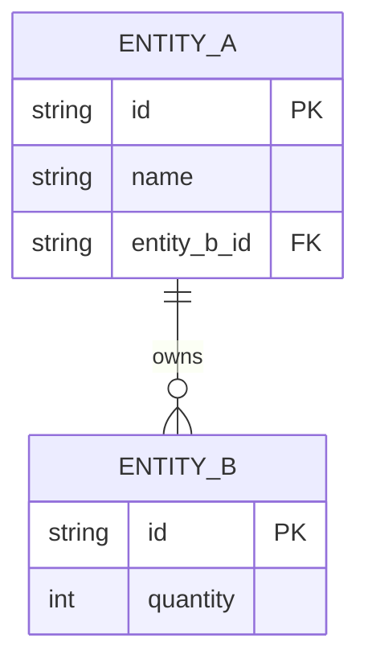
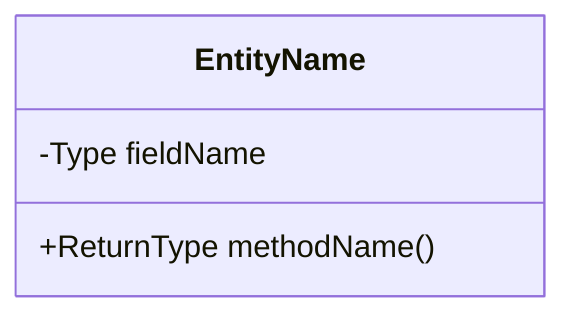
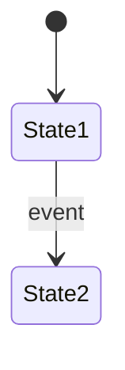

# LLD Design Prompt Template

> **FORMAT RULE: Always generate output as `.html` files, never `.md`. Use styled HTML with inline CSS for readability.**

Use this prompt whenever you need to design a Low Level Design (LLD) problem end-to-end.

---

## Prompt

```
Design the Low Level Design (LLD) for: **[SYSTEM NAME]**

Follow this exact structure:

---

### 1. CLARIFY REQUIREMENTS (Functional + Non-Functional)
List 5–8 functional requirements and 3–4 non-functional requirements.
Explicitly state what is OUT OF SCOPE.

---

### 2. IDENTIFY CORE ENTITIES
List every real-world noun in the system that needs its own class.
For each entity state:
- Name
- Responsibility (one sentence)
- Key attributes (3–5 fields with Java types)

Schema format:
| Entity | Responsibility | Key Fields |
|--------|---------------|------------|
| ...    | ...           | ...        |

---

### 2b. SCHEMA / ER DIAGRAM (Mermaid)
Generate a Mermaid `erDiagram` showing:
- All entities with their attributes and types
- Primary keys marked with `PK`, foreign keys with `FK`
- Relationships with cardinality (`||--o{`, `}o--o{`, `||--||`) and a verb label
- Use this to visualize the data schema BEFORE jumping into class relationships



---

### 3. CLASS DIAGRAM (Mermaid)
Generate a Mermaid classDiagram showing:
- All entities as classes with fields and methods
- Relationships: inheritance (--|>), composition (--*), aggregation (--o), association (-->)
- Interfaces and abstract classes clearly marked



---

### 4. DESIGN PATTERNS USED
For each pattern applied state:
- Pattern name
- Which classes participate
- Why this pattern fits here (one sentence)

---

### 5. SEQUENCE DIAGRAM for PRIMARY FLOW (Mermaid)
Show the happy-path sequence for the single most important operation.

```mermaid
sequenceDiagram
    actor User
    participant Service
    participant Repository
    ...
```

---

### 6. STATE DIAGRAM for KEY ENTITY (Mermaid)
Show all states and valid transitions for the entity with the most lifecycle complexity.



---

### 7. JAVA IMPLEMENTATION
Provide complete, compilable Java code in this order:
1. Enums
2. Interfaces / Abstract classes
3. Core entity classes (POJO + logic)
4. Service layer (business logic)
5. A main() demo that exercises the primary flow end-to-end

Rules:
- Use Java 17+ features where relevant (records, sealed classes, switch expressions)
- No frameworks (no Spring, no Hibernate) — pure Java
- Thread-safety: mark any shared state and explain synchronization choice
- Use Builder pattern for objects with >3 constructor params
- All collections via interfaces (List, Map, Set — not ArrayList directly)

---

### 8. INTUITION BUILDING — STEP BY STEP
Explain HOW to arrive at this design from scratch, as if teaching someone for the first time:

Step 1 — Start from the problem statement, not the solution
  → What is the single most important action a user performs?

Step 2 — Find the nouns (entities) and verbs (behaviors)
  → Nouns become classes, verbs become methods

Step 3 — Ask: who OWNS what?
  → Ownership drives composition vs aggregation

Step 4 — Identify what CHANGES STATE over time
  → These become your stateful entities; apply State pattern if transitions are complex

Step 5 — Spot repeated behavior → extract to interface/abstract class

Step 6 — Find the variation points (things likely to change)
  → Apply Strategy / Factory / Observer here

Step 7 — Check for concurrency needs
  → Any shared mutable state? → choose: synchronized / ConcurrentHashMap / locks

Step 8 — Write the happy path first, then edge cases
  → Design for the 80% case; don't over-engineer for hypotheticals

---

### 9. EXTENSION POINTS
List 3 ways this design can be extended without breaking existing code (Open/Closed Principle).

---

### 10. TRADE-OFFS & INTERVIEW TALKING POINTS
| Decision | Alternative | Why this choice |
|----------|------------|-----------------|
| ...      | ...        | ...             |

```

---

## How to Use
Replace `[SYSTEM NAME]` with your problem, e.g.:
- Parking Lot
- Elevator System
- Library Management System
- Food Delivery (Swiggy/Zomato)
- Ride Sharing (Ola/Uber)
- Movie Ticket Booking (BookMyShow)
- Vending Machine
- ATM Machine
- Rate Limiter
- Cache (LRU/LFU)

---

## Output Rules
- **Always save as `.html`**, never `.md`
- Use inline CSS for styling (dark code blocks, readable tables, section headers)
- Mermaid diagrams rendered via `<script src="https://cdn.jsdelivr.net/npm/mermaid/dist/mermaid.min.js">`
- File location: `LLD/<system-name>-lld.html`

---

## Required Page Layout (match `notes/vending-machine-lld.html` reference)

Every new LLD HTML file MUST follow this exact structural pattern for consistency with the rest of the site.

### 1. Dark theme CSS variables (use these exactly)
```css
:root{
  --bg:#0b0f14;--surface:#11161e;--surface2:#171d27;--border:#232b38;
  --text:#d4dae5;--muted:#7b8599;--heading:#f0f2f7;
  --orange:#e8743b;--orange-d:rgba(232,116,59,.12);
  --green:#38b265;--green-d:rgba(56,178,101,.1);
  --blue:#4a90d9;--blue-d:rgba(74,144,217,.1);
  --purple:#9b72cf;--purple-d:rgba(155,114,207,.1);
  --red:#e05252;--red-d:rgba(224,82,82,.1);
  --yellow:#d4a838;--yellow-d:rgba(212,168,56,.12);
  --cyan:#3cbfbf;--cyan-d:rgba(60,191,191,.1);
  --r:10px;
}
```

### 2. Fonts (Google Fonts CDN)
- `JetBrains Mono` → code blocks
- `DM Sans` → body text
- `Playfair Display` → h1/h2 headings

### 3. Hero section with back button (required at top)
```html
<div class="hero">
  <a class="back-btn" href="../design-development.html">← Back to Design &amp; Development</a>
  <div class="pill">Low-Level Design</div>
  <h1>System <span>Name</span></h1>
  <p class="sub">One-line description of the design</p>
</div>
```

Back button CSS (orange pill, floating top-left):
```css
.back-btn{position:absolute;top:1.5rem;left:1.8rem;z-index:2;display:inline-flex;align-items:center;gap:.4rem;color:var(--orange);text-decoration:none;font-weight:600;font-size:.82rem;padding:.45rem .9rem;border:1px solid var(--border);border-radius:100px;background:rgba(17,22,30,.6);backdrop-filter:blur(6px);transition:transform .2s,border-color .2s,color .2s}
.back-btn:hover{transform:translateX(-3px);border-color:var(--orange);color:#ffa675}
@media(max-width:600px){.back-btn{top:1rem;left:1rem;font-size:.75rem;padding:.35rem .75rem}}
```

### 4. Sidebar + content grid layout (NOT single-column `.wrap`)
```css
.layout{max-width:1920px;margin:0 auto;padding:3rem 4rem 5rem;display:grid;grid-template-columns:280px minmax(0,1fr);gap:4.5rem;align-items:start}
@media(max-width:1200px){.layout{padding:3rem 2rem 5rem;gap:3rem}}
@media(max-width:960px){.layout{grid-template-columns:1fr;gap:1.5rem;padding:2rem 1.2rem 4rem}}

.sidebar{position:sticky;top:2rem;font-size:.88rem}
@media(max-width:960px){.sidebar{position:static;top:auto;background:var(--surface);border:1px solid var(--border);border-radius:var(--r);padding:1.2rem 1.4rem}}
.sidebar h4{font-size:.72rem;font-weight:700;text-transform:uppercase;letter-spacing:.12em;color:var(--muted);margin-bottom:.85rem;padding-bottom:.5rem;border-bottom:1px solid var(--border)}
.sidebar ol{list-style:none;padding:0;counter-reset:sbtoc}
.sidebar ol li{counter-increment:sbtoc;margin-bottom:.35rem}
.sidebar ol li::before{content:counter(sbtoc,decimal-leading-zero);display:inline-block;width:1.8rem;color:var(--orange);font-weight:700;font-family:'JetBrains Mono',monospace;font-size:.75rem}
.sidebar a{color:var(--muted);text-decoration:none;transition:color .15s;font-size:.9rem}
.sidebar a:hover{color:var(--orange)}
@media(max-width:960px){.sidebar ol{display:grid;grid-template-columns:1fr 1fr;gap:.35rem 1rem}}
@media(max-width:560px){.sidebar ol{grid-template-columns:1fr}}

.sec{scroll-margin-top:1.5rem}
```

HTML structure:
```html
<div class="layout">
  <aside class="sidebar">
    <h4>On This Page</h4>
    <ol>
      <li><a href="#s1">Section 1</a></li>
      <li><a href="#s2">Section 2</a></li>
      <!-- one entry per section -->
    </ol>
  </aside>

  <div class="wrap">
    <div class="sec" id="s1">...</div>
    <div class="divider"></div>
    <div class="sec" id="s2">...</div>
    <!-- etc. Each section MUST have id="s{N}" matching its sidebar anchor -->
  </div>
</div>
```

### 5. Mermaid usage — mandatory diagram types

Every LLD page MUST use Mermaid diagrams (not ASCII art, not plain cards, not screenshots) for **all** the relational views below. Each diagram goes inside a `.diagram-box > .mermaid` wrapper.

| Purpose | Mermaid type | Example |
|---------|--------------|---------|
| Actors ↔ Use Cases (who does what) | `flowchart LR` | Guest → Search, Guest → Book, Receptionist → Check-In |
| ER / Schema | `erDiagram` | With `PK`/`FK` markers + cardinality `\|\|--o{` |
| Class relationships | `classDiagram` | Inheritance `<\|--`, composition `*--`, association `-->` |
| Key flows (Booking, Cancel, etc.) | `sequenceDiagram` | Actors + participants + alt/loop blocks |
| Entity lifecycle (if stateful) | `stateDiagram-v2` | e.g., Booking: CONFIRMED → CHECKED_IN → CHECKED_OUT |

**Actors & Use Cases — Mermaid flowchart example (ALWAYS use this pattern, not just `<div class="card">` lists):**
```html
<div class="diagram-box">
  <div class="mermaid">
flowchart LR
  G([Guest])
  R([Receptionist])
  H([Housekeeper])
  M([Manager])

  G --> S[Search Rooms]
  G --> B[Book Room]
  G --> C[Cancel Booking]
  R --> CI[Check-In]
  R --> CO[Check-Out]
  H --> MC[Mark Clean]
  M --> AR[Add/Edit Rooms]

  style G fill:#e8743b,stroke:#e8743b,color:#fff
  style R fill:#4a90d9,stroke:#4a90d9,color:#fff
  style H fill:#38b265,stroke:#38b265,color:#fff
  style M fill:#9b72cf,stroke:#9b72cf,color:#fff
  </div>
</div>
```
Each actor gets a distinct fill color (use the site palette — orange/blue/green/purple). Cards can appear ALONGSIDE the flowchart for quick scanning, but the flowchart is the primary relational representation.

---

### 6. Mermaid init config (dark theme, matching site palette)

The raw CDN script is not enough — Mermaid's default theme clashes with the dark background. Always include BOTH the CDN load and this initialization block **in `<head>`, right after the CDN script**:

```html
<script src="https://cdn.jsdelivr.net/npm/mermaid/dist/mermaid.min.js"></script>
<script>
  mermaid.initialize({
    startOnLoad: true,
    theme: 'dark',
    themeVariables: {
      fontSize: '13px',
      darkMode: true,
      background: '#11161e',
      primaryColor: '#171d27',
      primaryTextColor: '#d4dae5',
      primaryBorderColor: '#e8743b',
      lineColor: '#7b8599',
      secondaryColor: '#11161e',
      tertiaryColor: '#171d27'
    }
  });
</script>
```

Wrap every Mermaid diagram in a `.diagram-box` container (matches the card styling) so it blends with the rest of the surface cards:
```css
.diagram-box{background:var(--surface);border:1px solid var(--border);border-radius:var(--r);padding:1.6rem;overflow-x:auto;margin-bottom:1rem}
.diagram-box .mermaid{display:flex;justify-content:center;min-height:100px}
```

```html
<div class="diagram-box">
  <div class="mermaid">
erDiagram
  ...
  </div>
</div>
```

---

### 7. Register the new page in `design-development.html`
After creating the LLD file, ALWAYS add a card to `design-development.html` inside `.dd-grid`:
```html
<a class="dd-card" href="LLD/<system-name>-lld.html" target="_blank">
  <span class="dd-tag">LLD · Case Study</span>
  <h3 class="dd-card-title">System Name — LLD Design</h3>
  <p class="dd-card-desc">One-paragraph teaser of what the design covers.</p>
  <span class="dd-card-cta">Read the deep dive →</span>
</a>
```

---

## Checklist Before Declaring Done
- [ ] File at `LLD/<system-name>-lld.html` (or `notes/` for non-LLD deep dives)
- [ ] Dark theme CSS variables + Playfair/DM Sans/JetBrains Mono fonts
- [ ] Hero with `.back-btn` linking to `../design-development.html`
- [ ] Sidebar TOC with numbered list matching `id="s1"…"sN"` section anchors
- [ ] `.layout` grid (280px sidebar + content), NOT a single-column `.wrap`
- [ ] Mermaid CDN **+ dark-theme `mermaid.initialize({...})` block** in `<head>`
- [ ] Every diagram wrapped in `.diagram-box > .mermaid`
- [ ] Actors ↔ Use Cases rendered as `flowchart LR` with color-coded actor nodes (NOT just cards)
- [ ] ER diagram, class diagram, sequence diagrams, and state diagram all present as Mermaid
- [ ] New card added to `design-development.html` pointing to the file
